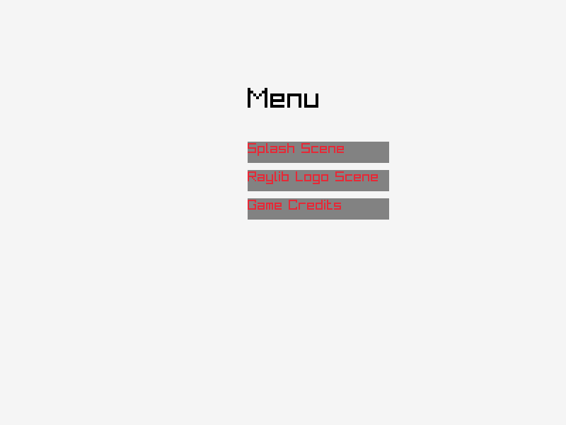
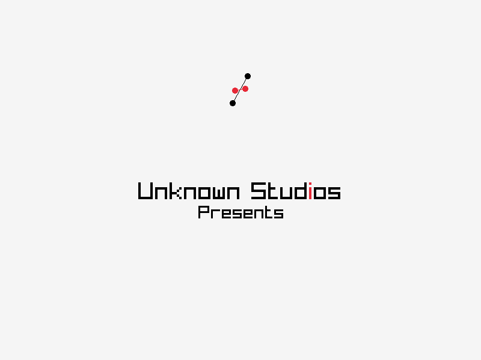
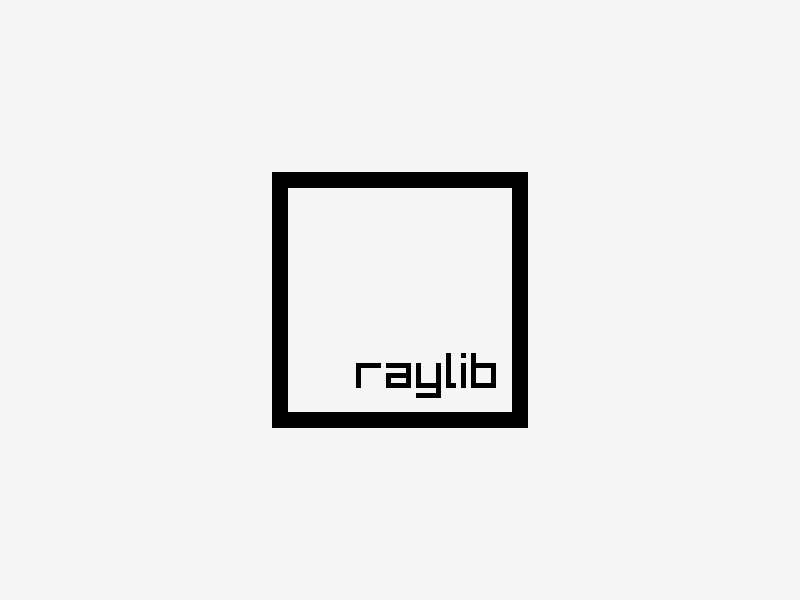
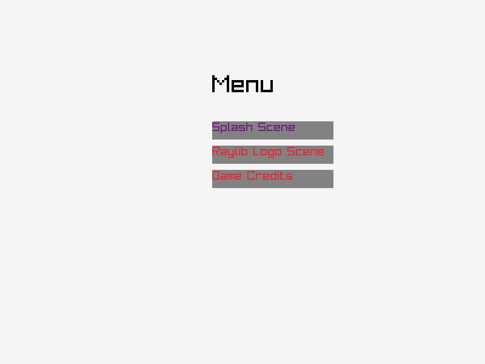
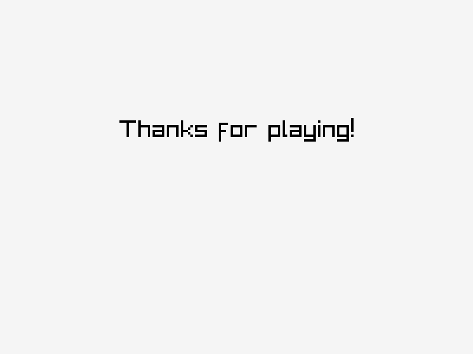

## Game Template



### Description

A template to quickly spin up interactive programs using [raylib](https://www.raylib.com/). Targets all desktop platforms and wasm.

This template implements 4 scenes:

- Splash:
    - The standard scene that plays at the beginning of a game
    - transitions to ray logo scene after t seconds or if the user clicks
- Raylib Logo Animation
    - Giving credit to the library that makes this possible with it's animated logo scene to play after the Splash scene  
    - transitions to menu scene after t seconds or if the user clicks
- Menu
    - offers several buttons that transition to all other scenes 
- Credit
    - transitions back to the menu after t seconds 


### How to build

Building a native binary is easy. Unless something upstream breaks all is already configured.

```bash
$ cd src/
$ make
```

Building for the web requires some setup. [source](https://github.com/raysan5/raylib/wiki/Working-for-Web-(HTML5))

```bash
$ yay -S emsdk
$ emsdk update  # requires privilege
$ emsdk install latest  # requires privilege
$ emsdk activate latest  # requires privilege
...
```

### Features

 - Scene system with animated and instant transitions
 - [Functional Relational architecture](http://curtclifton.net/papers/MoseleyMarks06a.pdf)
 - Buttons


### Screenshots

Images of the stub scenes implemented in this template.

Game studio splash scene


Raylib logo animation scene


Button hovering


Credit scene stub


 Developers

 - Akil Marshall
